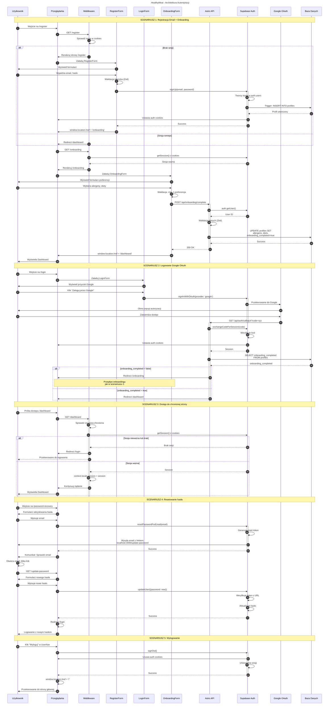

# Diagram Autentykacji - HealthyMeal MVP

Ten diagram przedstawia kompletną architekturę autentykacji dla aplikacji HealthyMeal, obejmując wszystkie scenariusze przepływu użytkownika.

## Opis Architektury

### Aktorzy Systemu

1. **Użytkownik** - osoba korzystająca z aplikacji
2. **Przeglądarka** - klient frontendowy (React components w Astro)
3. **Middleware** - warstwa ochrony tras (src/middleware.ts)
4. **Formularze React** - RegisterForm, LoginForm, OnboardingForm
5. **Astro API** - endpointy serwerowe (/api/auth/callback, /api/onboarding/complete)
6. **Supabase Auth** - system autentykacji
7. **Google OAuth** - zewnętrzny dostawca autentykacji
8. **Baza Danych** - tabela profiles z preferencjami użytkownika

### Scenariusze Pokryte przez Diagram

1. **Rejestracja Email + Onboarding** - nowy użytkownik tworzy konto przez email i wypełnia preferencje
2. **Logowanie Google OAuth** - użytkownik loguje się przez Google, system sprawdza czy wymaga onboardingu
3. **Dostęp do Chronionej Strony** - middleware weryfikuje sesję przed dostępem do /dashboard
4. **Resetowanie Hasła** - pełny przepływ odzyskiwania hasła przez email
5. **Wylogowanie** - zakończenie sesji użytkownika

### Kluczowe Mechanizmy Bezpieczeństwa

- **Middleware Protection** - każde żądanie przechodzi przez middleware weryfikujący sesję
- **Row Level Security (RLS)** - użytkownicy mogą modyfikować tylko własny profil
- **HTTP-Only Cookies** - tokeny przechowywane bezpiecznie, niedostępne dla JavaScript
- **Walidacja Serwerowa** - wszystkie API endpoints walidują dane z Zod
- **Onboarding Flag** - flag `onboarding_completed` zapewnia że nowi użytkownicy wypełnią preferencje

### Technologie

- **Astro SSR** - server-side rendering z Node adapter
- **React 19** - interaktywne komponenty formularzy
- **Supabase Auth** - zarządzanie autentykacją i sesjami
- **Zod** - walidacja schematów danych
- **Tailwind CSS + Shadcn/ui** - stylowanie komponentów

---

## Diagram Sekwencji



---

## Notatki Implementacyjne

### Middleware (src/middleware.ts)

- Uruchamia się na **każde żądanie** przed renderowaniem strony
- Tworzy server-side Supabase client z cookies
- Weryfikuje sesję: `supabase.auth.getSession()`
- Chroni trasy: `/dashboard`, `/profile`, `/onboarding`
- Przekierowuje niezalogowanych do `/login`
- Przekierowuje zalogowanych z `/login` i `/register` do `/dashboard`

### Database Trigger

Automatyczne tworzenie profilu po rejestracji:

```sql
CREATE FUNCTION create_profile_for_new_user()
RETURNS TRIGGER AS $$
BEGIN
  INSERT INTO public.profiles (id)
  VALUES (new.id);
  RETURN new;
END;
$$ LANGUAGE plpgsql;

CREATE TRIGGER on_auth_user_created
  AFTER INSERT ON auth.users
  FOR EACH ROW
  EXECUTE PROCEDURE public.create_profile_for_new_user();
```

### Konfiguracja Supabase

**Redirect URLs:**

- Lokalne: `http://localhost:3000/api/auth/callback`
- Produkcja: `https://[DOMENA]/api/auth/callback`

**Email Templates:**

- Password reset redirect: `http://localhost:3000/update-password`
- Język: Polski
- Email confirmation: **WYŁĄCZONE** (zgodnie z wymaganiem "szybko założyć konto")

### Metryka Sukcesu (PRD)

- **90% aktywacji**: Walidacja onboardingu wymaga wypełnienia min. 1 preferencji
- **Wsparcie Google OAuth**: Zmniejsza barierę wejścia dla nowych użytkowników
- **Błyskawiczny onboarding**: Email verification wyłączone, onboarding zaraz po rejestracji

---

## Referencje

- `prd.md` - wymagania produktowe
- `auth-spec.md` - specyfikacja techniczna modułu autentykacji
- `CLAUDE.md` - wytyczne projektu

**Data utworzenia**: 2025-11-04
**Wersja specyfikacji**: 1.0 (po aktualizacji portów i API endpoints)
