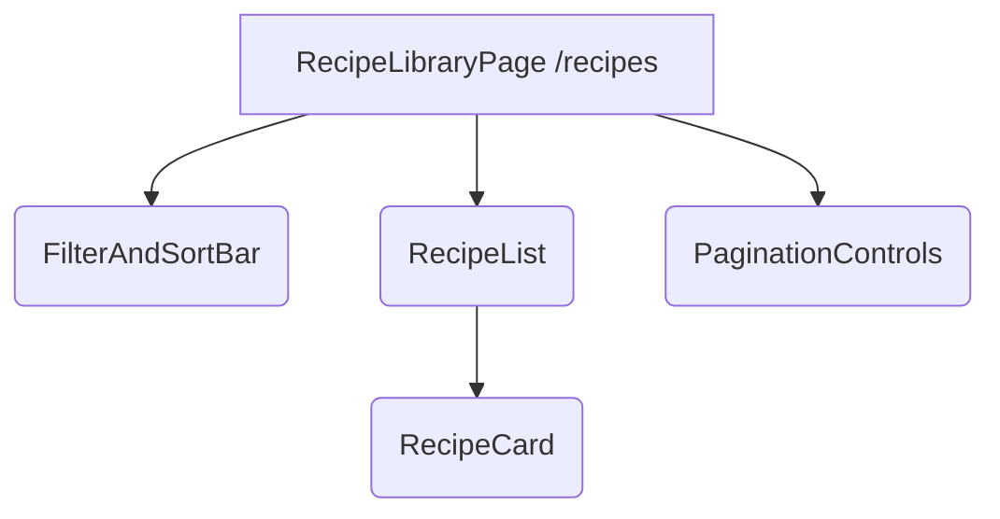

\<implementation_breakdown\>

## 1\. Analysis of Input Sections

### PRD (`prd.md`) Summary, Requirements, Constraints, and Issues

- **Summary:** The product is an application for managing and modifying user-inputted recipes using AI. Key features include user profiles with dietary preferences (Allergies, Diets, Disliked Ingredients), CRUD for recipes, and AI modification that creates a new copy of the recipe, not overwriting the original.
- **Requirements/Constraints:**
  - **Recipe Management (CRUD):** Users must be able to save and delete both original and AI-modified recipes.
  - **AI Modification:** AI generates a _new copy_ (never overwrites).
  - **Metadata:** Must be able to distinguish between original and AI-modified versions (via `original_recipe_id`).
  - **User Story Mapping:** The "Zarządzanie Przepisami" story confirms the need to display and manage both types.
- **Challenges/Issues:** The view must clearly and distinctly present the two types of recipes (original vs. AI-modified) as required by the "UX/Accessibility/Security" view description point.

### View Description Summary, Requirements, Constraints, and Issues

- **Summary:** The view is the **Recipe Library View** at `/recipes`. It lists all user recipes.
- **Requirements/Constraints:**
  - **Path:** `/recipes`.
  - **Content:** Recipe cards showing **title**, **status** (original/AI-modified), and **date** (`created_at`/`updated_at`).
  - **Functionality:** **Filter/Sort**, **Search**, **Pagination**.
  - **UX:** **Distinct visual states** for originals/AI-modified; filterable; all cards labeled for context; supports keyboard navigation.
- **Challenges/Issues:** Implementing a robust **Filter/Sort/Search/Pagination** interface that interacts correctly with the API, especially handling the conversion of URL query strings to the required data types (already handled by `GetRecipesQuerySchema` validation on the backend).

### User Stories Summary, Requirements, Constraints, and Issues

- **Summary:** "Jako użytkownik, chcę móc przeglądać listę przepisów. Na każdy przepis będzie można kliknąć, aby w następnym kroku dodać wyświetlanie szczegółów." (As a user, I want to be able to browse the list of recipes. Each recipe should be clickable to add detail display in the next step.)
- **Requirements/Constraints:**
  - Display a list of recipes.
  - Each list item (card) must be a clickable link to a detail view (`/recipes/{recipeId}`).
- **Challenges/Issues:** The link implementation needs to correctly use the `id` from the `RecipeListItemDto`.

### Endpoint Description Summary, Requirements, Constraints, and Issues

- **Summary:** `GET /api/recipes` retrieves a paginated list of user recipes.
- **Requirements/Constraints:**
  - **Method/Path:** `GET /api/recipes`.
  - **Query Params:** `page` (default 1), `pageSize` (default 10), `sortBy` (default 'created_at'), `order` (default 'desc').
  - **Response Type:** `PaginatedRecipesResponse` (`data` is an array of objects matching `RecipeListItemDto`, plus `pagination` metadata).
  - **Success Code:** `200 OK`.
  - **Error Codes:** `401 Unauthorized`, `500 Internal Server Error`.
- **Challenges/Issues:** Frontend must manage the URL search parameters to reflect the pagination and sorting state and must correctly map the received data structure.

### Endpoint Implementation Summary, Requirements, Constraints, and Issues

- **Summary:** `recipes.ts` handles the API route using `APIRoute` from Astro. It uses `recipe.schema.ts` for validation (`GetRecipesQuerySchema`) and calls `getUserRecipes` from `recipe.service.ts`.
- **Requirements/Constraints:**
  - The frontend must send query parameters as strings, as they are parsed from `context.url.searchParams` on the backend.
  - The `getUserRecipes` service function ensures results are filtered by `user_id` and handles sorting and pagination based on the validated options.
- **Challenges/Issues:** None specific to the frontend, as the backend handles complex validation (`parseInt`, `.pipe(z.number().int().positive())`, `.catch()`, `.max(100)`, `.enum()`) of the query parameters. The frontend simply needs to send standard string query parameters.

### Type Definitions (`types.ts`) Summary, Requirements, Constraints, and Issues

- **Summary:** Defines DTOs for recipe list items (`RecipeListItemDto`) and full details (`RecipeDetailDto`), and the command for creation (`CreateRecipeCommand`).
- **Requirements/Constraints:**
  - **Use `RecipeListItemDto`** for the data received from `GET /api/recipes`.
  - **`RecipeListItemDto` fields:** `id`, `user_id`, `title`, `original_recipe_id`, `created_at`, `updated_at`.
- **Challenges/Issues:** The frontend needs to create a **ViewModel** based on `RecipeListItemDto` to calculate the recipe status (Original vs. AI-Modified) and format the dates for display.

### Tech Stack (`tech-stack.md`) Summary, Requirements, Constraints, and Issues

- **Summary:** **Frontend:** Astro with React components, TypeScript, Tailwind 4, Shadcn/ui. **Backend:** Supabase (PostgreSQL, BaaS, Auth).
- **Requirements/Constraints:**
  - Use **React** for interactive components (List, Filter Bar, Pagination).
  - Utilize **Shadcn/ui** for components to ensure accessibility and consistent styling.
  - Use **TypeScript** for strong typing.
- **Challenges/Issues:** Ensuring all components adhere to Shadcn/ui conventions and that state management is robust in the React components hosted within Astro.

---

## 2\. Key Requirements Extraction from PRD

1.  **Recipe Display:** Show all user recipes (originals and AI-modified).
2.  **Distinction:** Clearly label and visually distinguish Original vs. AI-Modified recipes.
3.  **Core Data:** Display **Title**, **Status**, **Creation Date/Update Date**.
4.  **Action:** Each recipe must be clickable/linkable to the detail view.
5.  **Filtering/Sorting:** Implement controls for sorting by `created_at`, `updated_at`, `title` and ordering (`asc`/`desc`).
6.  **Pagination:** Implement controls for page number and page size (default 10, max 100).

---

## 3\. Needed Main Components

| Component Name         | Purpose                                                             | Types                                                                                    | Handled Events                                        | Validation Conditions                                                                           |
| :--------------------- | :------------------------------------------------------------------ | :--------------------------------------------------------------------------------------- | :---------------------------------------------------- | :---------------------------------------------------------------------------------------------- |
| **RecipeLibraryPage**  | Main container, fetches data, manages core state (pagination/sort). | `GetRecipesQuerySchemaType` (for state), `PaginatedRecipesResponse`, `RecipeViewModel[]` | `onSortChange`, `onPageChange`, `onPageSizeChange`    | Ensures query params are valid before API call (though API validates too).                      |
| **FilterAndSortBar**   | UI for filtering/sorting controls.                                  | None (local state for inputs)                                                            | `onSortChange` (passes `sortBy`, `order`), `onSearch` | None/Local only.                                                                                |
| **RecipeCard**         | Displays a single recipe item.                                      | `RecipeViewModel`                                                                        | `onClick` (navigation)                                | `RecipeViewModel.isOriginal` determines visual state.                                           |
| **RecipeList**         | Renders the list of `RecipeCard`s.                                  | `RecipeViewModel[]`                                                                      | None                                                  | None                                                                                            |
| **PaginationControls** | UI for page navigation and size selection.                          | `pagination` object from API                                                             | `onPageChange`, `onPageSizeChange`                    | `page` must be $1 \le page \le \text{totalPages}$, `pageSize` must be $1 \le pageSize \le 100$. |

---

## 4\. High-Level Component Tree Diagram



---

## 5\. Required DTOs and Custom ViewModel Types

### DTOs (from `types.ts` and API response)

- **`RecipeListItemDto`:** Used for the `data` array in the API response.
  ```typescript
  type RecipeListItemDto = {
    id: string;
    user_id: string;
    title: string;
    original_recipe_id: string | null; // Key for distinction
    created_at: string; // ISO date string
    updated_at: string; // ISO date string
  };
  ```
- **`PaginatedRecipesResponse`:** The full response structure.
  ```typescript
  interface PaginatedRecipesResponse {
    data: RecipeListItemDto[];
    pagination: {
      page: number;
      pageSize: number;
      total: number; // Total number of recipes
    };
  }
  ```
- **`GetRecipesQuerySchemaType`:** Used for managing the query state.
  ```typescript
  type GetRecipesQuerySchemaType = {
    page: number;
    pageSize: number;
    sortBy: "created_at" | "updated_at" | "title";
    order: "asc" | "desc";
  };
  ```

### Custom ViewModel: `RecipeViewModel`

A custom type is needed to simplify rendering and directly expose the "status" requirement.

```typescript
interface RecipeViewModel {
  // Directly from RecipeListItemDto
  id: string;
  title: string;
  // New computed properties
  isOriginal: boolean; // true if original_recipe_id is null
  statusLabel: "Original" | "AI-Modified"; // For display
  displayDate: string; // Formatted date string (e.g., 'October 23, 2023')
  linkPath: string; // The URL for the detail view: `/recipes/${id}`
}
```

**Mapping Logic:**

- `isOriginal`: calculated as `original_recipe_id === null`.
- `statusLabel`: if `isOriginal` is true, it's 'Original', otherwise 'AI-Modified'.
- `displayDate`: Formatted from `created_at` or `updated_at` (preferring `updated_at` for freshness, or just `created_at` if they are the same) using a locale-aware date formatter.

---

## 6\. Potential State Variables and Custom Hooks

### State Variables (within `RecipeLibraryPage`)

1.  **`queryState`**: Manages pagination and sorting parameters.
    - **Type:** `GetRecipesQuerySchemaType`
    - **Initial Value:** `{ page: 1, pageSize: 10, sortBy: 'created_at', order: 'desc' }`
    - **Purpose:** The source of truth for the API request and URL synchronization.
2.  **`recipes`**: The list of recipes to display.
    - **Type:** `RecipeViewModel[]`
    - **Initial Value:** `[]`
    - **Purpose:** Holds the data transformed from `RecipeListItemDto`.
3.  **`paginationMeta`**: Holds total count, current page, and page size.
    - **Type:** `{ page: number, pageSize: number, total: number }`
    - **Initial Value:** `{ page: 1, pageSize: 10, total: 0 }`
    - **Purpose:** Feeds the `PaginationControls` component.
4.  **`isLoading`**: Boolean flag.
    - **Type:** `boolean`
    - **Initial Value:** `true`
    - **Purpose:** Shows loading state (e.g., Skeleton loaders) during the API fetch.
5.  **`error`**: Holds any error message.
    - **Type:** `string | null`
    - **Initial Value:** `null`
    - **Purpose:** Displays an error banner if the API call fails.

### Custom Hooks

- **`useRecipeLibrary(initialQueryState)`**:
  - **Purpose:** Encapsulates the logic for fetching data, managing the `queryState`, and transforming the DTOs into `RecipeViewModel`.
  - **Responsibilities:**
    - Manages the `queryState` (and synchronizes it with URL search params if needed).
    - Performs the async `GET /api/recipes` call on mount and whenever `queryState` changes.
    - Transforms the response `data` into `RecipeViewModel[]`.
    - Returns `{ recipes, paginationMeta, isLoading, error, setQueryState }`.

---

## 7\. Required API Calls and Corresponding Frontend Actions

| API Call         | Method | Path                               | Request Type                                        | Response Type              | Frontend Action                                                 |
| :--------------- | :----- | :--------------------------------- | :-------------------------------------------------- | :------------------------- | :-------------------------------------------------------------- |
| Get Recipes List | `GET`  | `/api/recipes?page=...&sortBy=...` | Query string (based on `GetRecipesQuerySchemaType`) | `PaginatedRecipesResponse` | Fetch data in `useRecipeLibrary` on mount and parameter change. |

---

## 8\. Mapping User Stories to Implementation Details

| User Story                                                                                                | Implementation Detail                                                                                               | Components Involved                                                  |
| :-------------------------------------------------------------------------------------------------------- | :------------------------------------------------------------------------------------------------------------------ | :------------------------------------------------------------------- |
| "Jako użytkownik, chcę móc przeglądać listę przepisów." (Browse list)                                     | API call for paginated data, state management, list rendering.                                                      | `RecipeLibraryPage`, `RecipeList`, `RecipeCard`, `useRecipeLibrary`. |
| "Na każdy przepis będzie można kliknąć, aby w następnym kroku dodać wyświetlanie szczegółów." (Clickable) | Wrap `RecipeCard` or its title/area in an Astro `<a href={viewModel.linkPath}>` or a React Router `Link` component. | `RecipeCard`.                                                        |

---

## 9\. User Interactions and Expected Outcomes

| Interaction                               | Component            | Expected Outcome                                                                                                                           |
| :---------------------------------------- | :------------------- | :----------------------------------------------------------------------------------------------------------------------------------------- |
| Click 'Next Page' button.                 | `PaginationControls` | `queryState.page` is incremented. `useRecipeLibrary` refetches data. List updates.                                                         |
| Select a new sort option (e.g., 'title'). | `FilterAndSortBar`   | `queryState.sortBy` is updated. `useRecipeLibrary` refetches data. List updates.                                                           |
| Click on a `RecipeCard`.                  | `RecipeCard`         | Navigate to `/recipes/{recipeId}`.                                                                                                         |
| Select a new page size (e.g., 25).        | `PaginationControls` | `queryState.pageSize` is updated (and `queryState.page` might reset to 1). `useRecipeLibrary` refetches data. List and pagination updates. |

---

## 10\. API Conditions and Component Verification

| API Condition                  | Affected Components                      | Frontend Verification/Handling                                                                                                                                                                        |
| :----------------------------- | :--------------------------------------- | :---------------------------------------------------------------------------------------------------------------------------------------------------------------------------------------------------- |
| **Authentication (401)**       | `RecipeLibraryPage`                      | If the API returns 401, redirect the user to the login page or display an "Unauthorized" message.                                                                                                     |
| **Invalid Query Params (400)** | `FilterAndSortBar`, `PaginationControls` | The frontend should use the `GetRecipesQuerySchemaType` constraints for UI components (e.g., `pageSize` max 100 in the select dropdown) to prevent sending invalid parameters, minimizing 400 errors. |
| **`sortBy` Enum**              | `FilterAndSortBar`                       | Use only the allowed values: `created_at`, `updated_at`, `title` in the sort dropdown.                                                                                                                |
| **`pageSize` Max 100**         | `PaginationControls`                     | Limit the `pageSize` selection to a maximum of 100.                                                                                                                                                   |

---

## 11\. Potential Error Scenarios and Handling

| Error Scenario                | Component                         | Handling Strategy                                                                                                                                                    |
| :---------------------------- | :-------------------------------- | :------------------------------------------------------------------------------------------------------------------------------------------------------------------- |
| **401 Unauthorized**          | `RecipeLibraryPage`               | On API error (401), store error message, and redirect the user to the login/auth page.                                                                               |
| **500 Internal Server Error** | `RecipeLibraryPage`               | Display a prominent, user-friendly error message (e.g., "An unexpected error occurred while loading your recipes. Please try again later.") using the `error` state. |
| **No Recipes Found**          | `RecipeLibraryPage`, `RecipeList` | If `recipes.length === 0` AND `!isLoading`, display a "You haven't added any recipes yet\!" message with a CTA to create one.                                        |
| **Network Failure**           | `RecipeLibraryPage`               | Treat as a 500 error, displaying the general error message.                                                                                                          |

---

## 12\. Potential Challenges and Solutions

| Challenge                                                                                                                                                | Solution                                                                                                                                                                                                |
| :------------------------------------------------------------------------------------------------------------------------------------------------------- | :------------------------------------------------------------------------------------------------------------------------------------------------------------------------------------------------------ |
| **URL Synchronization:** Keeping the `queryState` synchronized with the URL search parameters so that the view state is preserved on refresh or sharing. | Use a library or custom logic (e.g., React's `useEffect` or an Astro-specific hook) to read initial state from `window.location.search` on mount and update `window.history` when `queryState` changes. |
| **Visual Distinction:** Ensuring the "Distinct visual states for originals/AI" is clear.                                                                 | Use the `isOriginal` property of `RecipeViewModel` to apply distinct styles (e.g., a different border color, icon, or a prominent "AI-Modified" badge/tag) to the `RecipeCard`.                         |
| **Date Formatting:** Displaying `created_at` or `updated_at` in a user-friendly format.                                                                  | Use `Intl.DateTimeFormat` in the `RecipeViewModel` transformation logic for locale-aware date display.                                                                                                  |

\</implementation_breakdown\>

````markdown
# View Implementation Plan Recipe Library View

## 1. Overview

The **Recipe Library View** is the central hub for authenticated users to browse and manage their saved recipes. It displays a paginated list of all recipes, distinguishing clearly between original user-inputted recipes and those modified by AI. This view implements filtering, sorting, and pagination controls, and allows navigation to the detailed view of any recipe.

## 2. View Routing

The view should be accessible at the following path:

- **Path:** `/recipes`
- **Astro Component:** Mapped to handle requests at this path.

## 3. Component Structure

The view will be built using a central container that manages state and delegates rendering to smaller, interactive components (React components within Astro).

```mermaid
graph TD
    A[RecipeLibraryPage /recipes (Astro/React Container)] --> B(FilterAndSortBar)
    A --> C(RecipeList)
    A --> D(PaginationControls)
    C --> E(RecipeCard)
```
````

## 4\. Component Details

### RecipeLibraryPage (Astro/React Container)

- **Component description:** The main view component responsible for managing the API query state (`queryState`), fetching the paginated data using a custom hook, handling errors, and coordinating child components.
- **Main elements:** The page layout, including a header, error/loading states, and the main layout grid containing the child components. It utilizes the custom hook `useRecipeLibrary`.
- **Handled interactions:** None directly; it handles state changes delegated from children (e.g., `onSortChange` from `FilterAndSortBar`).
- **Handled validation:** Manages the initial `queryState` and ensures API call is only made when parameters are valid/ready.
- **Types:** `PaginatedRecipesResponse`, `RecipeViewModel[]`, `GetRecipesQuerySchemaType`.
- **Props:** None (It's a page component).

---

### FilterAndSortBar (React Component, using Shadcn/ui)

- **Component description:** A bar component providing UI controls for sorting and (future) searching. It consists of select/dropdowns for `sortBy` and `order`.
- **Main elements:** Shadcn/ui `Select` components for:
  - **Sort By:** Options: 'created_at', 'updated_at', 'title'.
  - **Sort Order:** Options: 'asc', 'desc'.
  - _Search input (future/not in MVP API)._
- **Handled interactions:** `onChange` on the select/dropdowns.
- **Handled validation:** Select options are strictly limited to the values defined in `GetRecipesQuerySchema` (`sortBy` and `order` enums).
- **Types:** None (Local state for selection).
- **Props:**
  ```typescript
  interface FilterAndSortBarProps {
    currentSortBy: "created_at" | "updated_at" | "title";
    currentOrder: "asc" | "desc";
    onSortChange: (sortBy: string, order: string) => void;
  }
  ```

---

### RecipeList (React Component)

- **Component description:** A simple container component responsible for mapping the array of `RecipeViewModel` data to a list of `RecipeCard` components, handling the layout (e.g., grid or list).
- **Main elements:** A layout container (e.g., a Tailwind CSS grid) that iterates over the `RecipeViewModel[]` prop.
- **Handled interactions:** None.
- **Handled validation:** Renders a "No recipes found" message if the input array is empty and not loading.
- **Types:** `RecipeViewModel[]`.
- **Props:**
  ```typescript
  interface RecipeListProps {
    recipes: RecipeViewModel[];
    isLoading: boolean;
  }
  ```

---

### RecipeCard (React Component, using Shadcn/ui Card)

- **Component description:** Renders a single, clickable recipe item. It visually distinguishes between original and AI-modified recipes.
- **Main elements:** Shadcn/ui `Card` component. Contains:
  - Recipe **Title** (as a link).
  - **Status Badge/Tag** ('Original' or 'AI-Modified').
  - **Date** (`displayDate`).
- **Handled interactions:** `onClick` leading to navigation to `RecipeViewModel.linkPath`.
- **Handled validation:** Uses `RecipeViewModel.isOriginal` to apply a distinct visual style/badge (e.g., different color/icon) to meet the UX requirement.
- **Types:** `RecipeViewModel`.
- **Props:**
  ```typescript
  interface RecipeCardProps {
    recipe: RecipeViewModel;
  }
  ```

---

### PaginationControls (React Component, using Shadcn/ui)

- **Component description:** Provides buttons for page navigation and a select for page size.
- **Main elements:** Buttons for 'Previous' and 'Next' page, a `Select` component for page size (e.g., 10, 25, 50, 100).
- **Handled interactions:** `onClick` for page buttons, `onChange` for page size select.
- **Handled validation:** 'Previous' button disabled on page 1. 'Next' button disabled on the last page. Page size select options are limited to $1 \le pageSize \le 100$.
- **Types:** `pagination` object from `PaginatedRecipesResponse`.
- **Props:**
  ```typescript
  interface PaginationControlsProps {
    pagination: {
      page: number;
      pageSize: number;
      total: number;
    };
    onPageChange: (newPage: number) => void;
    onPageSizeChange: (newSize: number) => void;
  }
  ```

## 5\. Types

The view uses the DTOs provided by the API and introduces one custom ViewModel for easier rendering.

### Data Transfer Object (DTO)

- **`RecipeListItemDto`** (From `types.ts`): The structure of a single recipe item returned in the list.
  ```typescript
  type RecipeListItemDto = {
    id: string; // The recipe's unique ID
    user_id: string; // ID of the user who owns the recipe
    title: string;
    original_recipe_id: string | null; // Crucial for distinguishing AI-modified copies
    created_at: string; // ISO date string
    updated_at: string; // ISO date string
  };
  ```
- **`PaginatedRecipesResponse`** (From `recipe.service.ts`): The full API response payload.
  ```typescript
  interface PaginatedRecipesResponse {
    data: RecipeListItemDto[];
    pagination: {
      page: number;
      pageSize: number;
      total: number;
    };
  }
  ```

### Custom ViewModel

- **`RecipeViewModel`**: A derived type used by `RecipeCard` to simplify display logic and satisfy the PRD requirement for distinction.

| Field         | Type                          | Derivation/Purpose                                                                                    |
| :------------ | :---------------------------- | :---------------------------------------------------------------------------------------------------- |
| `id`          | `string`                      | Passthrough from DTO.                                                                                 |
| `title`       | `string`                      | Passthrough from DTO.                                                                                 |
| `isOriginal`  | `boolean`                     | `original_recipe_id === null`. Used for styling.                                                      |
| `statusLabel` | `'Original' \| 'AI-Modified'` | If `isOriginal` is true, 'Original', otherwise 'AI-Modified'.                                         |
| `displayDate` | `string`                      | Formatted from DTO's `updated_at` (or `created_at` if no update) using a locale-aware date formatter. |
| `linkPath`    | `string`                      | Computed as `/recipes/${id}` for navigation.                                                          |

## 6\. State Management

State will be managed using a custom React Hook, which encapsulates the fetching, state management, and DTO-to-ViewModel transformation logic.

- **Custom Hook: `useRecipeLibrary`**
  - **Purpose:** Centralizes data fetching and query state management.
  - **Internal State:** `queryState` (`GetRecipesQuerySchemaType`), `recipes` (`RecipeViewModel[]`), `paginationMeta`, `isLoading`, `error`.
  - **Mechanism:**
    1.  Initializes `queryState` from URL search parameters or defaults.
    2.  Uses `React.useEffect` to fetch data whenever `queryState` changes.
    3.  The fetch function constructs the URL with the query string and handles the API call.
    4.  Transforms received `RecipeListItemDto` array into `RecipeViewModel[]`.
  - **Returned Value:** `{ recipes, paginationMeta, isLoading, error, setQueryState }`.

## 7\. API Integration

The view integrates with the `GET /api/recipes` endpoint.

- **HTTP Method:** `GET`
- **URL Path:** `/api/recipes`
- **Request:** The `useRecipeLibrary` hook will construct the request with query parameters based on the current `queryState`:

  ```
  /api/recipes?page={number}&pageSize={number}&sortBy={string}&order={string}
  ```

  - _Example:_ `/api/recipes?page=2&pageSize=10&sortBy=title&order=asc`

- **Request Type:** Query string parameters corresponding to `GetRecipesQuerySchemaType`.
- **Response Type:** `PaginatedRecipesResponse`. The hook transforms `PaginatedRecipesResponse.data` into `RecipeViewModel[]`.

## 8\. User Interactions

| Interaction              | Location             | Handler                                                                                | Outcome                                                         |
| :----------------------- | :------------------- | :------------------------------------------------------------------------------------- | :-------------------------------------------------------------- |
| **Change Sort By/Order** | `FilterAndSortBar`   | `onSortChange` prop of `FilterAndSortBar` calls `setQueryState` in `useRecipeLibrary`. | Triggers a new API call with updated sort parameters.           |
| **Change Page Number**   | `PaginationControls` | `onPageChange` prop of `PaginationControls` calls `setQueryState`.                     | Triggers a new API call for the requested page.                 |
| **Change Page Size**     | `PaginationControls` | `onPageSizeChange` prop calls `setQueryState` (may also reset `page` to 1).            | Triggers a new API call with new page size.                     |
| **Click Recipe Card**    | `RecipeCard`         | Navigation link built from `RecipeViewModel.linkPath`.                                 | Navigates the user to the detail view at `/recipes/{recipeId}`. |

## 9\. Conditions and Validation

Frontend validation ensures the user interface only attempts to send valid parameters, complementing the robust backend validation.

- **Authentication Check:** If the API returns a **401 Unauthorized** error, the application must immediately redirect the user to the login page.
- **Query Parameter Constraints:**
  - `sortBy`: Only `created_at`, `updated_at`, or `title` can be selected in `FilterAndSortBar`.
  - `order`: Only `asc` or `desc` can be selected.
  - `pageSize`: Select options in `PaginationControls` should not exceed 100.
- **Pagination Bounds:**
  - 'Previous' button in `PaginationControls` is disabled when `pagination.page` is 1.
  - 'Next' button in `PaginationControls` is disabled when `pagination.page` reaches the total number of pages (`Math.ceil(total / pageSize)`).
- **Recipe Status:** `RecipeCard` applies a distinct visual style (e.g., color, badge) based on `RecipeViewModel.isOriginal` to meet the PRD's distinction requirement.

## 10\. Error Handling

The `useRecipeLibrary` hook handles API errors and updates the `error` state.

- **API Errors (401/500):** If an error (e.g., 500 Internal Server Error) occurs during the fetch, the `RecipeLibraryPage` must:
  1.  Set the `error` state with a user-friendly message (e.g., "Could not load recipes. Please try again.").
  2.  Display a prominent error banner/alert component instead of the `RecipeList`.
  3.  For a **401 Unauthorized** error, perform a client-side redirect to the login flow.
- **No Results:** If `!isLoading` and `recipes.length === 0`, display a state message to the user encouraging them to create their first recipe.
- **Loading State:** Use **Skeleton Loaders** (Shadcn/ui) in place of `RecipeList` while `isLoading` is true.

## 11\. Implementation Steps

1.  **Define Types:** Create `RecipeViewModel` interface and the DTO types for use in the components.
2.  **Implement `useRecipeLibrary` Hook:**
    - Set up state variables (`queryState`, `recipes`, `paginationMeta`, `isLoading`, `error`).
    - Implement `useEffect` for data fetching on `queryState` change.
    - Include logic to transform `RecipeListItemDto` to `RecipeViewModel` (calculating `isOriginal`, `statusLabel`, `displayDate`, `linkPath`).
    - Handle API error responses (especially 401 and 500).
3.  **Implement Leaf Components:**
    - **`RecipeCard`:** Implement the visual distinction logic based on `recipe.isOriginal` and link the whole card to `recipe.linkPath`.
    - **`FilterAndSortBar`:** Use Shadcn/ui `Select` components to allow changing `sortBy` and `order`, calling the `onSortChange` prop.
    - **`PaginationControls`:** Implement buttons and page size select, calling `onPageChange` and `onPageSizeChange` props.
4.  **Implement Container Components:**
    - **`RecipeList`:** Renders the grid of `RecipeCard`s, handles loading/empty state.
    - **`RecipeLibraryPage`:** Use `useRecipeLibrary` to fetch data. Render `FilterAndSortBar`, `RecipeList`, and `PaginationControls`, passing down the necessary data and callback handlers to update `queryState`.
5.  **Routing:** Configure Astro to render `RecipeLibraryPage` at the `/recipes` path.

<!-- end list -->

```

```
